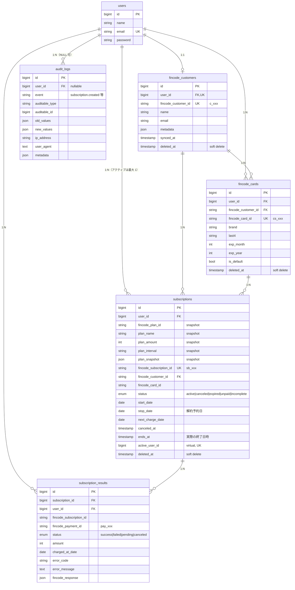

[English](./data-model.md) / 日本語

# データモデル

永続化層のスキーマリファレンス。一次情報は `database/migrations/` にあり、本ドキュメントは「**なぜこの形になっているか**」を補足します（マイグレーション本体には書かれていない設計意図）。

## ER 図



## 各テーブル

### `users`

Laravel Breeze 標準のユーザーテーブル。アプリ側のアイデンティティ。**1 ユーザーは最大 1 つの Fincode カスタマーに対応**。

### `fincode_customers`

Fincode カスタマーオブジェクトのローカルミラー。`users.id` ⇔ `fincode_customer_id`（Fincode が発行する `c_xxx`）の橋渡し。

- `user_id` は **UNIQUE**（1 ユーザー 1 カスタマー）。
- `synced_at` は最後の同期成功時刻。`CustomerSyncService.ensureFincodeCustomer` により初回カード登録時に遅延作成される。
- アカウント削除時の監査証跡を保つためソフトデリート対象。

### `fincode_cards`

登録カードのローカルミラー。**PAN は保存しない**。保持するのは `brand`・`last4`・Fincode 側のカード ID（`cs_xxx`）のみで、機微情報自体は Fincode 側にある。

- `is_default` は補助情報。契約時にどのカードを使うかはアプリが決める。
- ソフトデリートにより、ユーザーが「削除」した後でも過去契約からの参照が成立する。画面表示は `deleted_at IS NULL` でフィルタ。

### `subscriptions` — 一番重い責務を負うテーブル

設計判断 2 点を補足します。

#### プラン情報を契約行にスナップショット

元は `plans` テーブルがあり `subscriptions.plan_id` で JOIN していました。マイグレーション `2026_02_14_160200_remove_plans_table_and_add_subscription_plan_snapshot` で、プラン属性（`plan_name` / `plan_amount` / `plan_interval` / `plan_interval_count` および `plan_snapshot` JSON 全体）を契約自身に持たせ、`plans` テーブルを削除しました。

**理由：**

1. プランの正本は **Fincode 管理画面**。これをアプリ側の可変テーブルにミラーすると差分が生じ得る（管理画面でプラン名や金額を変更したのにアプリ側が古いままなど）。
2. ユーザー視点で契約は不変。契約時の金額は管理者の後発的な編集で書き換わってはならない（請求履歴の正確性）。
3. JOIN を排除することで契約履歴画面のクエリが単純化された。

「契約可能プランの一覧」画面は Fincode API から都度取得（`PlanService` ＋ キャッシュ）。

#### アクティブ契約の一意制約は DB レベルで保証

```sql
-- migration 2026_02_21_010000
ALTER TABLE subscriptions ADD COLUMN active_user_id BIGINT UNSIGNED
  AS (CASE WHEN status = 'active' AND deleted_at IS NULL THEN user_id ELSE NULL END) VIRTUAL;
ALTER TABLE subscriptions ADD UNIQUE KEY subscriptions_active_user_id_unique (active_user_id);
```

仮想カラム `active_user_id` は「アクティブかつ未削除」のときだけ `user_id`、それ以外は `NULL`。`NULL` は一意制約をすり抜けるため、過去の解約契約は重複扱いにならない。**同一ユーザーで 2 件目のアクティブ契約は INSERT 時点で失敗**。アプリ側の事前チェックは多重防御という位置付け。

`status` enum： `active | canceled | expired | unpaid | incomplete`。状態遷移は `SubscriptionManager` が担当し、`SubscriptionStatusChanged` イベントを発火する。

### `subscription_results`

課金 1 回ごとの履歴。Fincode の課金イベントごとに 1 行。決済履歴画面で利用。

- `fincode_response` は Fincode の生レスポンス JSON（フォレンジック用途）。
- `status` enum： `success | failed | pending | canceled`。
- `(subscription_id, charged_at_date)` にインデックス（時系列参照向け）。

### `audit_logs`

ポリモーフィックな監査証跡。`SubscriptionManager` / `CardManager` / `CustomerSyncService` の状態変更操作はすべて `AuditLogger` 経由で 1 行書き込む。

- `auditable_type` + `auditable_id` で任意モデル（Subscription / FincodeCard / FincodeCustomer）を指す。
- `old_values` / `new_values` は **差分ではなく全 JSON スナップショット**。ストレージコストは許容、調査価値は高い。
- `user_id` は NULL 可（Webhook ハンドラ・バッチ等のシステム発火操作を `null` で記録するため）。
- `event` はドット区切りの名前（`subscription.created`、`card.deleted`、`customer.updated`）。

**リクエストパスから `audit_logs` を SELECT しないこと**。書き込み専用テーブルで、ホット読み込み経路を作るとインデックスを圧迫します。管理ツール・障害調査専用です。

## ソフトデリート対象まとめ

| テーブル | ソフトデリート | 理由 |
| --- | --- | --- |
| `users` | しない | Breeze のアカウント削除フローに従う |
| `fincode_customers` | **する** | 監査・同一メールの再登録時の再リンク |
| `fincode_cards` | **する** | 過去契約から参照可能にする |
| `subscriptions` | **する** | 請求履歴の正確性 |
| `subscription_results` | しない | 不変・常時保持 |
| `audit_logs` | しない | append-only |

## 外部キーの ON DELETE 挙動

| 親 → 子 | ON DELETE | 理由 |
| --- | --- | --- |
| `users → fincode_customers` | CASCADE | ユーザーなしのカスタマーは無意味 |
| `users → fincode_cards` | CASCADE | 同上 |
| `users → subscriptions` | CASCADE | ユーザーなしの契約は存在しない（履歴は `audit_logs` に残る） |
| `users → subscription_results` | CASCADE | 同上 |
| `users → audit_logs` | SET NULL | システム発火ログをユーザー削除後も残す |
| `fincode_customers → fincode_cards` | CASCADE | カスタマー消滅時にカードも消す |
| `subscriptions → subscription_results` | CASCADE | 結果は契約に従属 |
| `fincode_cards → subscriptions` | CASCADE（[`2026_03_10_010000_change_subscriptions_fincode_card_foreign_key_to_cascade`](../../database/migrations/2026_03_10_010000_change_subscriptions_fincode_card_foreign_key_to_cascade.php) で変更） | カード削除時にクリーンに掃除可能 |

## 関連ドキュメント

- [`database/migrations/`](../../database/migrations/) — 一次情報。
- [overview.ja.md](./overview.ja.md) — Manager がどのようにこれらを更新するか。
- [error-handling.ja.md](./error-handling.ja.md) — 失敗時の記録方法。
