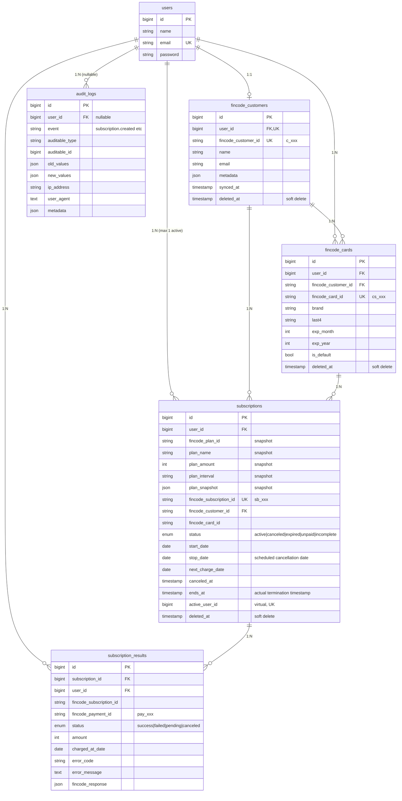

English / [日本語](./data-model.ja.md)

# Data model

Schema reference for the persistence layer. The authoritative source is `database/migrations/`. This document explains **why** the schema looks the way it does — which the migrations alone do not say.

## ER diagram



## Tables

### `users`

Standard Laravel Breeze users table. The application identity. **One user maps to at most one Fincode customer.**

### `fincode_customers`

Local mirror of the Fincode customer object. Bridges `users.id` ⇔ `fincode_customer_id` (the `c_xxx` ID issued by Fincode).

- `user_id` is **unique** — a user has at most one Fincode customer.
- `synced_at` records the last successful sync. Lazy-created on first card registration via `CustomerSyncService.ensureFincodeCustomer`.
- Soft delete preserves the audit trail when an account is closed.

### `fincode_cards`

Local mirror of registered cards. **The full PAN is never stored** — only `brand`, `last4`, and the Fincode-side card ID (`cs_xxx`) for which Fincode itself holds the sensitive data.

- `is_default` is informational; the application chooses which card to use when subscribing.
- Soft delete keeps cards visible to historical audits even after the user "deletes" them. Live screens filter on `deleted_at IS NULL`.

### `subscriptions` — the table that does the most work

Two design choices deserve explanation:

#### Plan data is **snapshotted into the subscription row**

Originally there was a separate `plans` table joined via `subscriptions.plan_id`. Migration `2026_02_14_160200_remove_plans_table_and_add_subscription_plan_snapshot` moved plan attributes (`plan_name`, `plan_amount`, `plan_interval`, `plan_interval_count`, plus the full `plan_snapshot` JSON) onto the subscription itself, then dropped the `plans` table.

**Why:**

1. The source of truth for plans is the **Fincode management console**. Mirroring it as a local mutable table risked drift: if an admin renamed or repriced a plan in Fincode, the local copy could disagree with what the user actually subscribed to.
2. Subscriptions are immutable from the user's perspective once started — the price they signed up for must remain visible in their billing history regardless of later admin edits to the plan.
3. Removing the join simplified queries on the subscription history screen.

The screen-level "list of available plans" now comes directly from the Fincode API on demand (`PlanService` + cache).

#### Single active subscription enforced by a unique index

```sql
-- migration 2026_02_21_010000
ALTER TABLE subscriptions ADD COLUMN active_user_id BIGINT UNSIGNED
  AS (CASE WHEN status = 'active' AND deleted_at IS NULL THEN user_id ELSE NULL END) VIRTUAL;
ALTER TABLE subscriptions ADD UNIQUE KEY subscriptions_active_user_id_unique (active_user_id);
```

The virtual column is `user_id` only when the row is active and not soft-deleted, otherwise `NULL`. `NULL` values bypass the unique constraint, so historical canceled subscriptions don't conflict. **A second active subscription for the same user fails at insert time** — the application's pre-check is defense-in-depth against races, not the only line of defense.

`status` enum: `active | canceled | expired | unpaid | incomplete`. State transitions are handled by `SubscriptionManager` and emit `SubscriptionStatusChanged` events.

### `subscription_results`

Per-charge history. One row per Fincode billing event. Use this for "Payment history" UIs.

- `fincode_response` holds the raw Fincode payload as JSON for forensics.
- `status` enum: `success | failed | pending | canceled`.
- Indexed on `(subscription_id, charged_at_date)` for chronological lookups.

### `audit_logs`

Polymorphic audit trail. Every state-changing operation in `SubscriptionManager`, `CardManager`, and `CustomerSyncService` writes a row here via `AuditLogger`.

- `auditable_type` + `auditable_id` point to any model (Subscription, FincodeCard, FincodeCustomer).
- `old_values` / `new_values` are full JSON snapshots — not just changed fields. Storage cost is acceptable; investigative value is high.
- `user_id` is nullable so system-initiated changes (Webhook handlers, batch jobs) can be logged with `null`.
- `event` is a dotted name (`subscription.created`, `card.deleted`, `customer.updated`).

**Do not query `audit_logs` from request-path code.** It is a write-mostly table; a hot read path can dominate the index. Use it for administrative tooling and incident response.

## Soft delete summary

| Table | Soft delete? | Reason |
| --- | --- | --- |
| `users` | No | Use Breeze's account deletion flow. |
| `fincode_customers` | **Yes** | Audit & re-link if a user re-registers with the same email. |
| `fincode_cards` | **Yes** | Cards linked to past subscriptions remain referenceable. |
| `subscriptions` | **Yes** | Required for compliant billing history. |
| `subscription_results` | No | Always retained; immutable by design. |
| `audit_logs` | No | Append-only. |

## Foreign key cascade behavior

| Parent → Child | On delete | Why |
| --- | --- | --- |
| `users → fincode_customers` | CASCADE | Customer is meaningless without a user. |
| `users → fincode_cards` | CASCADE | Same. |
| `users → subscriptions` | CASCADE | Subscriptions cannot exist without a user. (Audit history lives in `audit_logs`.) |
| `users → subscription_results` | CASCADE | Same. |
| `users → audit_logs` | SET NULL | System-initiated logs survive user deletion. |
| `fincode_customers → fincode_cards` | CASCADE | A card cannot survive its customer. |
| `subscriptions → subscription_results` | CASCADE | Results belong to the subscription. |
| `fincode_cards → subscriptions` | CASCADE on subscription cancellation flow ([migration `2026_03_10_010000_change_subscriptions_fincode_card_foreign_key_to_cascade`](../../database/migrations/2026_03_10_010000_change_subscriptions_fincode_card_foreign_key_to_cascade.php)) | Allows clean teardown when a card is removed. |

## See also

- [`database/migrations/`](../../database/migrations/) — the source of truth.
- [overview.md](./overview.md) — how managers update these tables transactionally.
- [error-handling.md](./error-handling.md) — how failures are recorded.
