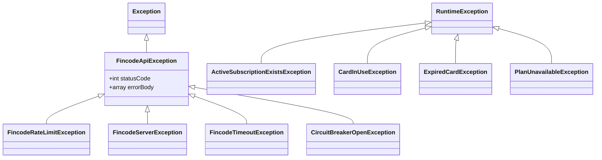

[English](./error-handling.md) / 日本語

# エラーハンドリング

失敗がどう伝播し、何がユーザーに見え、何がログ／監査に残り、何が再試行されるかをまとめます。

## 例外階層



2 系統に分かれています：

- **`FincodeApiException` 系**：Fincode API またはその保護ラッパに由来する失敗。`statusCode` と `errorBody` を保持し、呼び出し元が分岐できる。
- **業務例外**（`extends RuntimeException`）：ドメインロジックが検出する不変条件違反。Fincode と独立。

## 各例外の発生条件

### Fincode 系

| 例外 | 発生時 | 呼び出し元の挙動 |
| --- | --- | --- |
| `FincodeApiException`（基底） | より特殊なサブクラスで拾えない非 2xx 応答 | 汎用的な「処理失敗」を表示。自動再試行はしない |
| `FincodeRateLimitException` | Fincode から HTTP 429 | クライアントに 429 を返し、クライアント側で待機。`FincodeClient` の内部リトライは 429 を **再試行しない**（Fincode のレート枠を浪費しない） |
| `FincodeServerException` | Fincode から HTTP 5xx | `FincodeClient` がバックオフ付きで再試行。最終失敗で Circuit Breaker をインクリメント |
| `FincodeTimeoutException` | 接続タイムアウト・読み取りタイムアウト | 5xx と同様。再試行 → 最終失敗でブレーカ加算 |
| `CircuitBreakerOpenException` | 呼び出し時点で Circuit Breaker が `open` | 即時失敗。Fincode を呼ばない。ユーザーには「一時的に利用不可」を返す |

### 業務系

| 例外 | 発生箇所 | 発生理由 |
| --- | --- | --- |
| `ActiveSubscriptionExistsException` | `SubscriptionManager.subscribe` | 既にアクティブ契約あり。クライアントには 409 Conflict。DB 側の `active_user_id` 一意制約が二重防御（[data-model.ja.md](./data-model.ja.md) 参照） |
| `CardInUseException` | `CardManager.delete` | アクティブ契約から参照されているカード。先に解約またはカード変更が必要 |
| `ExpiredCardException` | `CardManager.register` / `SubscriptionManager.subscribe` | 有効期限切れ。Fincode 呼び出し前に検出 |
| `PlanUnavailableException` | `PlanService.fetch` / `SubscriptionManager.subscribe` | 要求プランが Fincode 上に存在しないか非アクティブ |

## Circuit Breaker

実装：`app/Services/Fincode/CircuitBreaker.php`。状態はキャッシュ（`Cache::store(...)`）に保持。

```mermaid
stateDiagram-v2
    [*] --> closed
    closed --> open : failure_count ≥ failure_threshold
    open --> half-open : recovery_timeout 経過
    half-open --> closed : recordSuccess()
    half-open --> open : recordFailure()
```

設定（`config/fincode.php` の `circuit_breaker`）：

| キー | 既定値 | 意味 |
| --- | --- | --- |
| `enabled` | `true` | マスタースイッチ。テスト等で無効化可 |
| `failure_threshold` | `5` | `closed` 状態でこの回数連続失敗すると `open` |
| `recovery_timeout` | `30`（秒） | `open` 状態がこの時間経過すると、1 回だけ通す（`half-open`） |

挙動：

- `open` 中は Fincode 呼び出しが即時 `CircuitBreakerOpenException` で失敗。ネットワーク IO 自体を行わない。
- `half-open` では **最初の 1 回だけ** 通す。成功で `closed`、失敗で再び `open`。
- **4xx 応答はブレーカ加算対象外**（クライアント側の問題であり、障害ではない）。加算対象は 5xx・タイムアウト・接続失敗のみ。

## ユーザーに見せるもの

例外ハンドラ（`bootstrap/app.php` の `->withExceptions(...)`）がドメイン例外を HTTP ステータスにマップします：

| 例外 | HTTP ステータス | ユーザーが見るもの |
| --- | --- | --- |
| `FincodeRateLimitException` | 429（`Retry-After` 付き） | 「決済サービスのレート制限に達しました…」 |
| `CircuitBreakerOpenException` | 503（`Retry-After` 付き） | 「決済サービスへの接続が一時的に遮断されています…」 |
| `FincodeTimeoutException` | 504 | 「決済サービスへの接続がタイムアウトしました。」 |
| `FincodeServerException` | 503 | 「決済サービスでサーバーエラーが発生しました。」 |
| `CardInUseException` | 409 | 例外メッセージそのまま |
| `ExpiredCardException` | 422 | `card_id` をキーにしたバリデーション形式 |
| `PlanUnavailableException` | 422 | `fincode_plan_id` をキーにしたバリデーション形式 |
| `ActiveSubscriptionExistsException` | 422 | `fincode_plan_id` をキーにしたバリデーション形式 |
| `FincodeApiException`（その他） | 401/403 は 502、それ以外の 4xx はそのまま、5xx／不明は 503 | 「決済サービスとの通信でエラーが発生しました。」 |

非 API リクエストでは同じ例外が `Error` Inertia ページ（`resources/js/Pages/Error.tsx`）として該当ステータスでレンダリングされます。実際のアサーションは `tests/Feature/ExceptionHandlerTest.php` を参照。

**Fincode のエラーボディをそのままクライアントに返さないこと**。識別子等が含まれる場合があり、サポート対応には有用ですが、レスポンスではなく監査ログ／構造化アプリログから取得する設計です。

## ログに残るもの

`FincodeClient` は Fincode 呼び出しごとに構造化ログを出力：method・path・status・request ID・latency・**マスク済みリクエスト／レスポンスボディ**。

- カード番号・CVC・トークンはロガーに渡る前にマスク済み。
- 例外時は `Throwable::getTrace()` を含めてキャプチャ。
- 監査ログ（`audit_logs` テーブル）は **業務的な操作結果**を記録する。HTTP 詳細はそこに入れない。HTTP フォレンジックはログ、「誰が何をしたか」は監査ログ、と切り分ける。

## 再試行ポリシー

`FincodeClient` 内部：

| 原因 | 再試行 | 方法 |
| --- | --- | --- |
| 接続／読み取りタイムアウト | する | 指数バックオフ、最大回数あり |
| HTTP 5xx | する | 同上 |
| HTTP 429 | **しない** | 即時返却。Fincode のレート枠を浪費しない |
| HTTP 4xx（429 以外） | **しない** | クライアント側の問題で、再試行しても解決しない |
| Circuit Breaker open | **しない** | 障害時のリトライ抑止こそブレーカの存在理由 |

再試行時は **同じ Idempotency-Key を再利用**（Fincode 側で重複排除）。

## `AuditLogger` との関係

`SubscriptionManager` / `CardManager` は、Fincode 呼び出しが**成功した後**かつトランザクション**コミット前**に監査ログを書き込む。Fincode 呼び出しが例外の場合、その試行に対する監査行は書かれない（監査の視点では「操作は発生しなかった」）。

つまり：

- **成功した操作**には必ず対応する `audit_logs` 行がある。
- **失敗した操作**は構造化アプリケーションログにのみ残る。`audit_logs` には現れない。

「試行履歴」が必要な fork では別テーブルを追加してください。`audit_logs` を失敗で汚染しないこと。
