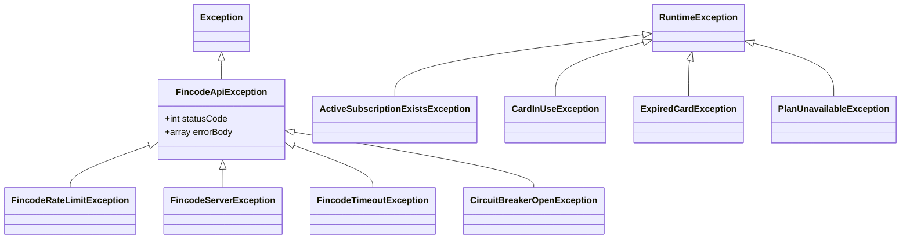

English / [日本語](./error-handling.ja.md)

# Error handling

How failures propagate, what becomes visible to the user, what is logged, and what is retried.

## Exception hierarchy



Two families:

- **`FincodeApiException` family** — failures originating from the Fincode API or its protective wrappers. Carry `statusCode` and `errorBody` so callers can branch.
- **Business exceptions** (`extends RuntimeException`) — invariant violations detected by our domain logic, independent of Fincode.

## When each is raised

### Fincode-side family

| Exception | Raised when | Caller behavior |
| --- | --- | --- |
| `FincodeApiException` (base) | Any non-2xx Fincode response that isn't covered by a more specific subclass. | Surface a generic "operation failed" message; do not retry automatically. |
| `FincodeRateLimitException` | HTTP 429 from Fincode. | Surface as a 429 to the client; the client should back off. The internal retry loop in `FincodeClient` does **not** retry 429 — Fincode's rate budget is shared and we should not burn it. |
| `FincodeServerException` | HTTP 5xx from Fincode. | Internal retry with backoff (`FincodeClient`). Final failure increments the Circuit Breaker. |
| `FincodeTimeoutException` | Connection / read timeout to Fincode. | Same as 5xx: retry, then break the circuit. |
| `CircuitBreakerOpenException` | Circuit Breaker is in `open` state at the moment of call. | Fail fast. Do not call Fincode. The user gets a friendly "service temporarily unavailable" response. |

### Business family

| Exception | Raised by | Why |
| --- | --- | --- |
| `ActiveSubscriptionExistsException` | `SubscriptionManager.subscribe` | The user already has an active subscription. Returned to clients as 422 Unprocessable Entity (validation-style payload keyed by `fincode_plan_id`). The DB unique index on `active_user_id` is the second line of defense — see [data-model.md](./data-model.md). |
| `CardInUseException` | `CardManager.delete` | The card is referenced by an active subscription. Forces the user to cancel or change card first. |
| `ExpiredCardException` | `CardManager.register`, `SubscriptionManager.subscribe` | Card expiration date is in the past. Surfaced before any Fincode call. |
| `PlanUnavailableException` | `PlanService.fetch`, `SubscriptionManager.subscribe` | The requested plan does not exist on Fincode or is inactive. |

## Circuit breaker

Implementation: `app/Services/Fincode/CircuitBreaker.php`. State is held in the cache (`Cache::store(...)`).

```mermaid
stateDiagram-v2
    [*] --> closed
    closed --> open : failure_count ≥ failure_threshold
    open --> half-open : recovery_timeout elapsed
    half-open --> closed : recordSuccess()
    half-open --> open : recordFailure()
```

Configuration (`config/fincode.php` → `circuit_breaker`):

| Key | Default | Meaning |
| --- | --- | --- |
| `enabled` | `true` | Master switch. Disable in tests where needed. |
| `failure_threshold` | `5` | Consecutive failures in `closed` state that flip the breaker to `open`. |
| `recovery_timeout` | `30` (seconds) | After this much time in `open`, a single probe is allowed (`half-open`). |

Behavior:

- In `open`, every Fincode call raises `CircuitBreakerOpenException` immediately. Network IO is not attempted.
- In `half-open`, the **first** call is allowed through. Success closes the circuit; failure re-opens it.
- 4xx responses **do not** count as breaker failures — they indicate a client problem, not an outage. Only 5xx, timeouts, and connection failures count.

## What's surfaced to the user

The HTTP exception handler in `bootstrap/app.php` (`->withExceptions(...)`) maps domain exceptions to status codes:

| Exception | HTTP status | What the user sees |
| --- | --- | --- |
| `FincodeRateLimitException` | 429 (with `Retry-After`) | "決済サービスのレート制限に達しました…" |
| `CircuitBreakerOpenException` | 503 (with `Retry-After`) | "決済サービスへの接続が一時的に遮断されています…" |
| `FincodeTimeoutException` | 504 | "決済サービスへの接続がタイムアウトしました。" |
| `FincodeServerException` | 503 | "決済サービスでサーバーエラーが発生しました。" |
| `CardInUseException` | 409 | The exception message verbatim. |
| `ExpiredCardException` | 422 | Validation-shaped error keyed on `card_id`. |
| `PlanUnavailableException` | 422 | Validation-shaped error keyed on `fincode_plan_id`. |
| `ActiveSubscriptionExistsException` | 422 | Validation-shaped error keyed on `fincode_plan_id`. |
| `FincodeApiException` (other) | 502 for 401/403, pass-through for other 4xx, 503 for 5xx / unknown | "決済サービスとの通信でエラーが発生しました。" |

For non-API requests, the same exceptions render an `Error` Inertia page (`resources/js/Pages/Error.tsx`) with the matching status code. See `tests/Feature/ExceptionHandlerTest.php` for the assertions that pin this behavior.

**Do not** leak Fincode error bodies to the client. They may contain identifiers that are useful for support but should be retrieved via the audit log or structured app log, not via the HTTP response.

## What's logged

`FincodeClient` writes a structured log line for every Fincode call: method, path, status code, request ID, latency, and the **masked** request / response bodies.

- Card numbers, CVC, and tokens are masked **before** being passed to the logger.
- On exception, the full chain is captured (`Throwable::getTrace()`).
- The audit log (`audit_logs` table) records the **business outcome** of the operation, not the HTTP details. Use logs for HTTP forensics, audit logs for "who did what."

## Retry policy

Inside `FincodeClient`:

| Cause | Retry? | How |
| --- | --- | --- |
| Connection timeout / read timeout | Yes | Exponential backoff, capped retry count. |
| HTTP 5xx | Yes | Same backoff. |
| HTTP 429 | **No** | Surface immediately; do not consume Fincode's rate budget. |
| HTTP 4xx (except 429) | **No** | A 4xx is a client mistake; retrying will not help. |
| Circuit Breaker open | **No** | The breaker exists precisely to prevent retries during an outage. |

Retries always reuse the **same Idempotency-Key** so Fincode deduplicates them on its side.

## Relationship with `AuditLogger`

`SubscriptionManager` / `CardManager` write an audit log row **after** the Fincode call succeeds and **before** the transaction commits. If the Fincode call throws, no audit row is written for that attempt — the operation never happened from the audit perspective.

This means:

- **Successful operations** always have a matching `audit_logs` row.
- **Failed operations** are visible only in the structured application log; they are not in `audit_logs`.

For a fork that needs an "attempted operations" log, add a separate table; do not pollute `audit_logs` with failures.
