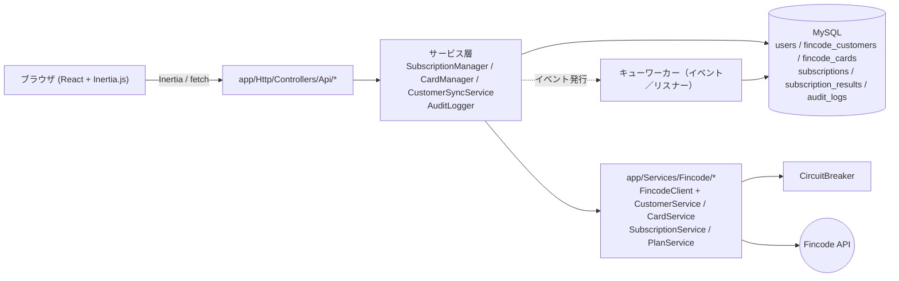
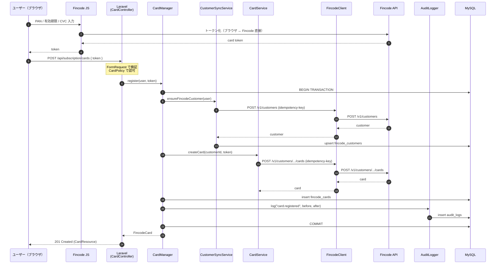
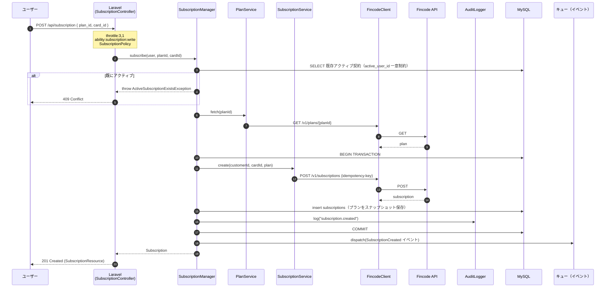

[English](./overview.md) / 日本語

# アーキテクチャ概要

リクエストがどのレイヤを通り、なぜそのレイヤが存在し、どこに何の責務があるかをまとめた設計概要です。

## 全体構成図

ブラウザから Fincode API を直接叩くのは **カードトークン化（Fincode JS）のみ**。トークンだけがサーバーに届きます。

## レイヤごとの責務

| レイヤ | ディレクトリ | 責務 | やってはいけないこと |
| --- | --- | --- | --- |
| Controller | `app/Http/Controllers/` | 入力検証（FormRequest）、認可（Policy）、Manager / Service の呼び出し、レスポンス整形（Resource） | Fincode API を叩く。ビジネスロジック。書き込み系の DB ファサード直接利用 |
| Manager | `app/Services/SubscriptionManager.php`、`CardManager.php`、`CustomerSyncService.php` | 1 つの業務操作の調整。状態変更を `DB::transaction()` で囲む。イベント発行。監査ログ記録 | HTTP リクエスト構築。Fincode のレスポンス形式の知識 |
| Fincode サービス | `app/Services/Fincode/CustomerService.php`、`CardService.php`、`SubscriptionService.php`、`PlanService.php` | ドメイン呼び出しを Fincode API 呼び出しに翻訳。レスポンスを型付き値またはドメイン例外に変換 | ローカル DB を触る。Eloquent モデルを知る |
| Fincode クライアント | `app/Services/Fincode/FincodeClient.php` | Bearer 認証、Idempotency-Key、リトライ、ログのマスク、Circuit Breaker 連携 | 業務的な意味を持つロジック |
| Resource | `app/Http/Resources/` | API レスポンス JSON の整形。機微情報のマスク／除去 | クエリを発行する |
| Policy | `app/Policies/` | 所有権チェック（`$user->id === $card->user_id` 等） | 業務例外を投げる |

## なぜ Inertia.js？

Inertia.js を採用することで、Web UI はサーバーサイドルートをそのまま流用でき、SPA ナビゲーションも実現できます。Web UI 用に独自の REST 契約を維持する必要がなく、`Inertia::render(...)` がそのまま画面を返します。`routes/api.php`（Sanctum で保護）の REST API は **外部クライアント（モバイル・サードパーティ統合）専用**で、その仕様は [docs/api/openapi.yml](../api/openapi.yml) に定義されています。

## シーケンス：カード登録

重要な不変条件：

- **PAN・CVC は Laravel に到達しない**。届くのは Fincode トークンのみ。
- Idempotency-Key は **リクエストごとに 1 つ生成**し、`FincodeClient` 内のリトライで再利用される。ネットワーク再試行による二重登録は発生しない。
- Fincode 側成功・ローカル INSERT 失敗の場合、トランザクションがローカルをロールバックしても **Fincode 側のカードは残る**。次回同一ユーザーのリクエストでは `CustomerSyncService.ensureFincodeCustomer` が既存カスタマーを再利用するため整合性は保たれる。孤児になった Fincode カードはバッチで突合・整理可能。

## シーケンス：サブスクリプション登録

重要な不変条件：

- **1 ユーザー 1 アクティブ契約**を、アプリ層（Manager のチェック）と DB 層（仮想カラム `active_user_id` への一意インデックス `subscriptions_active_user_id_unique`）の二重で保証。レースが発生しても DB が二重契約を弾く。
- **プラン情報は契約作成時点で `subscriptions` 行にスナップショット保存**（`plan_name` / `plan_amount` / `plan_interval` / `plan_snapshot` JSON）。以降、契約は `plans` テーブルに依存しない。詳細は [data-model.ja.md](./data-model.ja.md)。
- イベント（`SubscriptionCreated`、`SubscriptionStatusChanged` 等）は **トランザクションコミット後に発火**し、キューワーカーが副作用（通知、下流同期）を処理する。

## キューの利用箇所

`composer dev` は web サーバーに加えて `php artisan queue:listen` を起動します。キューの担当：

- イベント由来の監査ログ書き込み（`app/Listeners/` 配下）。
- メール通知（登録、メール認証）。
- サブスク／カードイベントの下流処理。

本番環境では `queue:work` を Supervisor 配下で常駐させてください。詳細は [docs/operations/deployment.ja.md](../operations/deployment.ja.md)。

## 次に読むもの

- [data-model.ja.md](./data-model.ja.md) — スキーマとリレーション。
- [error-handling.ja.md](./error-handling.ja.md) — 例外階層、Circuit Breaker、リトライ方針。
- [../getting-started/local-development.ja.md](../getting-started/local-development.ja.md) — ローカル実行手順。
- [../api/openapi.yml](../api/openapi.yml) — REST API 契約。
