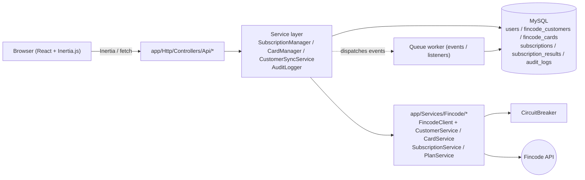
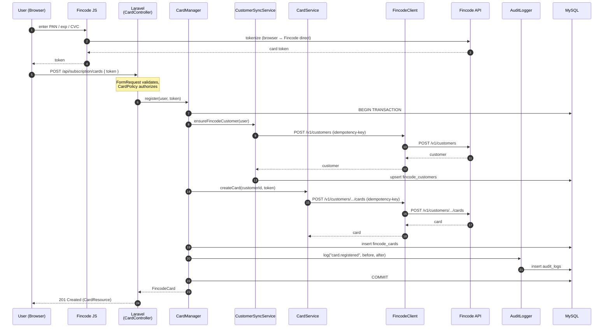
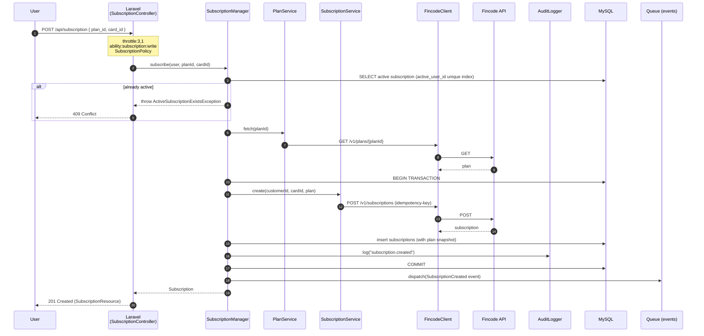

English / [日本語](./overview.ja.md)

# Architecture overview

This document describes how a request flows through the application, why the layers exist, and where each responsibility lives.

## High-level diagram

The browser does **not** call the Fincode API directly except for **card tokenization** (Fincode JS in the browser produces a single-use token; the token is what the server receives).

## Layer responsibilities

| Layer | Directory | Responsibility | What it must NOT do |
| --- | --- | --- | --- |
| Controller | `app/Http/Controllers/` | Validate input (FormRequest), authorize (Policy), call a single Service / Manager method, format response (Resource) | Talk to Fincode API. Run business logic. Use the DB facade directly for writes. |
| Manager | `app/Services/SubscriptionManager.php`, `CardManager.php`, `CustomerSyncService.php` | Orchestrate one business operation. Wrap state changes in `DB::transaction()`. Emit events. Write audit logs. | Construct HTTP requests. Know about Fincode response shapes. |
| Fincode service | `app/Services/Fincode/CustomerService.php`, `CardService.php`, `SubscriptionService.php`, `PlanService.php` | Translate domain calls into Fincode API calls. Map Fincode response into typed return values or domain exceptions. | Touch the local DB. Care about Eloquent models. |
| Fincode client | `app/Services/Fincode/FincodeClient.php` | Bearer auth, Idempotency-Key, retries, sensitive log masking, Circuit Breaker integration. | Implement business semantics. |
| Resource | `app/Http/Resources/` | Shape JSON for the API response. Strip / mask anything sensitive. | Run queries. |
| Policy | `app/Policies/` | Ownership check (`$user->id === $card->user_id`, etc.). | Throw business exceptions. |

## Why Inertia.js?

The app uses Inertia.js to share the same Laravel routes for both server-rendered pages and SPA navigation. This avoids maintaining a separate REST contract for the web UI; the same controllers serve `Inertia::render(...)` to the browser. The dedicated REST API (`routes/api.php`, Sanctum-protected) exists for **external clients** (mobile, third-party integrations) and is the surface documented in [docs/api/openapi.yml](../api/openapi.yml).

## Sequence: card registration

Key invariants:

- **Full PAN / CVC never reaches Laravel.** Only the Fincode token does.
- The Idempotency-Key is generated **once per request** and reused on retries inside `FincodeClient`. Network retries do not register the card twice on Fincode.
- If the Fincode call succeeds but the local insert fails, the transaction rolls back the local row but **the Fincode-side card already exists**. The next request from the same user will reuse the existing customer (via `CustomerSyncService.ensureFincodeCustomer`); orphaned Fincode cards can be reconciled by background tooling.

## Sequence: subscription creation

Key invariants:

- **One active subscription per user** is enforced both by application logic (manager-level check) and by the DB-level unique index `subscriptions_active_user_id_unique` on the virtual column `active_user_id`. Even a race condition cannot create a duplicate.
- **Plan data is snapshotted into the `subscriptions` row at creation time** (`plan_name`, `plan_amount`, `plan_interval`, `plan_snapshot` JSON). After this, the subscription does not depend on a separate `plans` table — see [data-model.md](./data-model.md) for the rationale.
- Events (`SubscriptionCreated`, `SubscriptionStatusChanged`, etc.) are dispatched after the transaction commits and processed by the queue worker for side effects (notifications, downstream sync).

## Where the queue is used

`composer dev` runs `php artisan queue:listen` in addition to the web server. The queue handles:

- Audit log persistence triggered by events (in `app/Listeners/`).
- Email notifications (registration, email verification).
- Downstream side effects of subscription / card events.

In production, run a long-lived `queue:work` under Supervisor — see [docs/operations/deployment.md](../operations/deployment.md).

## Where to read next

- [data-model.md](./data-model.md) — schema and relationships.
- [error-handling.md](./error-handling.md) — exception hierarchy, Circuit Breaker, retry policy.
- [../getting-started/local-development.md](../getting-started/local-development.md) — run it locally.
- [../api/openapi.yml](../api/openapi.yml) — REST API contract.
